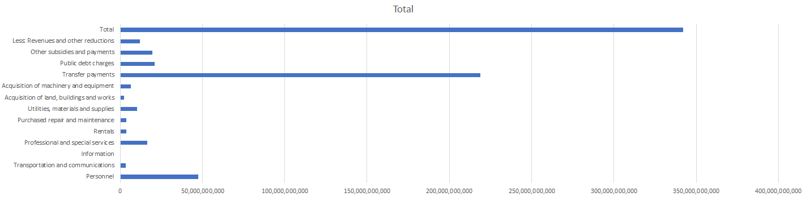

# **Reflection**

06/16/2021

## **Week Four: Government projected spending 2021-2022**

I have always wondered what our tax money has been used for and/or will be used for and this seemed like a perfect opportunity to see where and how they expect to use our tax dollars. This week I investigate exactly which parts of the government are expected to receive the most money and how they are allocated in each part. Though this is a future estimate, it begs the question what our government is working towards and which issues seem to be the most prevalent and costly.

## **Static-websites**

Created this as a static website on github.

## **Working in RStudio**

 With Rstudio I was able to clean up the csv file and make it easier to look at the more specific information such as how Canada plans to spend 3.6 billion on rentals next year or how they are planning to pay 20b in debt charges. This includes how the government is currently over 2.34 trillion in debt and pays off little by little each year. Assuming that the government was to continue to pay off their debt 20b each year it would take us over 100 years to pay off our current debt not counting inflation or accrued interest. Another area to note is the amount put towards Employment and Social Development with an alloted 82billion in total and the efforts the government will be putting forward in post covid times to save the economy. Though this may seem like a lot of money now, we must take into consideration the stimulus checks provided throughout the last 2 years that may have impacted the market and the value of our money.

Something to take note off while working in this topic is that 2021-2022 should be the year with many facilities openings back up with covid ending hopefully by the end of 2021 and certain things like the via rail and other services the government providing taking extra steps to keep people safe. These all may affect how much they are spending.

## **Working in Excel with a csv file**

Working in Excel makes it easier to make graphs and see how our tax money is spent. From the graph. From the graph you can see that most of our tax money goes toward Transfer Payments, which include things such as health care, post-secondary education, social services and more. They plan to spend over 270 billion dollars in the year 2021-2022 though most of the care they provide still seems lacking which begs the question how efficiently these dollars are spent. Other aspects you can note from the document is the total expenditure on rentals that the government pay for, with a total of almost 4billion dollars. These numbers are unexpected with most people assuming that the government has access to most things with ownership and renting being very low.

